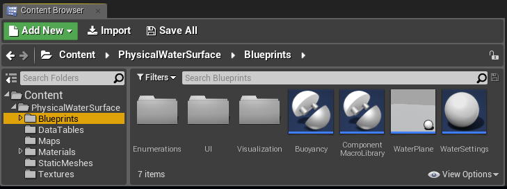
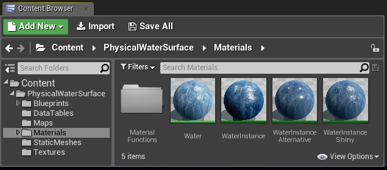

# 概览

**Physical Water Surface**是基于Unreal Engine 4的高性能、物理校正、简单易用的水体着色器(Shader)。其以大量不同海况的波谱数据并可无缝过渡，一个实时计算的浮力(Buoyancy)系统为优势。  

  

* 真实水体模拟：使用物理校正波谱实现的Gerstner波
* 自适应海况模拟：水体模拟效果自适应于选择的风速(Wind speed 1-35m/s)和扬波距离(Fetch length 50-1500km)
* 海况无缝过渡：在不同海况和风速间优雅并且完全平滑的过渡
* 高质量的浮力系统：自动部署的基于精确物理的浮力。漂浮物可以充分地与UE4物理系统互动
* 高性能：基于蓝图(Blueprint)实现的浮力系统并且可以自动本地化(Nativized)为C++代码(已验证版本为4.14或更高)
* 剔除(Mask)船内穿模水体：提供隐藏船内穿模水体的一种方法
* 无限海洋系统：水体可以伴随摄像机平移和缩放，从而营造无限海洋的假象
* 无限平铺水体材质：使用已创建的水体模型或者应用水体材质到你自己的模型(Mesh)上
* 支持AI导航网格(NavMesh)：AI导航网格可创建在水体上
* 兼容[Orbit Weather and Seasons](https://www.unrealengine.com/marketplace/orbit-weather-and-seasons)

# 开始

Physical Water Surface用**Water Plane Blueprint** 和**Buoyancy Component**使物体漂浮，用**Water Settings**控制水体波形效果。  

## 如何在level中添加水体

首先，添加一个**Water Settings**到你的关卡(Level)，其作用是管理波谱数据并实时更改水体材质的材质参数(Material Parameter)。Level中必须有且只有一个Water Settings。  

其次，添加一个或多个**Water Plane**。现在就拥有了一个可工作的水体！如果当前关卡为空关卡，还应该添加一个天空光(Sky Light)和一个后处理特效体(PostProcessVolume)，并开启FXAA和Unbound(高版本为Infinite Extent)。如果你正在使用4.14或更高版本，需要手动选择**Project Settings -> Rendering -> Anti-Aliasing Method**下的FXAA。  

默认海况设置为风速(Wind Speed)10m/s，扬波距离(Fetch Length)50km。只需要在Water Settings的细节面板(Detail Panel)中选择不同的值就可以改变为不同的海况。  

如果Water Plane细节面板中的**Follow Camera**设置为true，该Water Plane就会自动平移和缩放来创造无限海洋的假象。你如果正在创建一个湖泊，最好关闭这个选项并创建一个准确大小的自定义水体模型。如果你开启了这个选项，一个好方法是在网格视图模式(Wireframe View Mode)下检查该水体模型是否按预期自动缩放。  

Physical Water Surface拥有三个不同的继承自Water Material的材质实例(Water Instance)：  

- **WaterInstance**
- **WaterInstanceShiny**
- **WaterInstanceAlternative**

如需改变水体材质，在Water Plane细节面板中选择不同的材质实例即可。如需微调水体效果，修改材质实例的参数即可。  

## 水体表面光照

水体表面效果很大程度上受周围环境影响，无论是无限海洋的天空球(Sky Sphere)还是湖泊的毗邻景观(Landscape)。如果你有一个反光程度很大的水体材质的话，就会明白这点是相当正确的。一种使水体表面更具反射性的方法是添加**Reflection Capture Actors**，这样水体表面的渲染效果将会被反射所主导。  

开始建立光照之前，请先检查示例关卡，下面是建立基础光照的设置：  

* 使用关卡中的默认天空球(Sky Sphere)和光源(Light Source)
* 修改天空球的光照亮度(Sun Brightness)和其所链接的线性光源方向(Rotation)
* 添加一个天空光(Sky Light)并设置其源类型(Source Type)为**SLS Captured Scene**，这将会从所有角度照亮水体表面和其漂浮物体
* 添加一个**Lightmass Importance Volume**并将其放大(Scale Up)，例如放大50倍。在视图中，使用**Show -> Vizualize -> Volume Lighting Samples**选项来使你在该体积中拥有多个样本(Sample)。光照样本(Lighting Sample)通常只在静态物体表面上方大量生成，但是由于无限海洋系统的缘故，水体被设置为了可移动物体(Movable)。当我们使Lightmass Importance Volume足够大的时候，引擎将会在该体积中散在地创建一些光照样本，这些用来照亮漂浮在水体上的物体已经足够了，甚至会溢出该体积边界。

## 使用漂浮组件(The Buoyancy Component)使物体漂浮

浮力组件可以添加到任意静态或骨骼模型上，跟随以下步骤使用浮力组件：  

1. 将模型移动性设置为可移动(Movable)。不要跳过这一步！
2. 在你模型的细节面板中点击**Add Component**并选择**Buoyancy Component**。浮力组件将会显现在细节面板中。
3. 在细节面板中点击浮力组件，选择浮力模式：**Single Points**, **Auto Points** 和 **Manual Points**。如果你正在使用Auto Points，可以使用下面的附加选项来微调浮力运动。
4. 点击**Play**观察动态浮力效果。